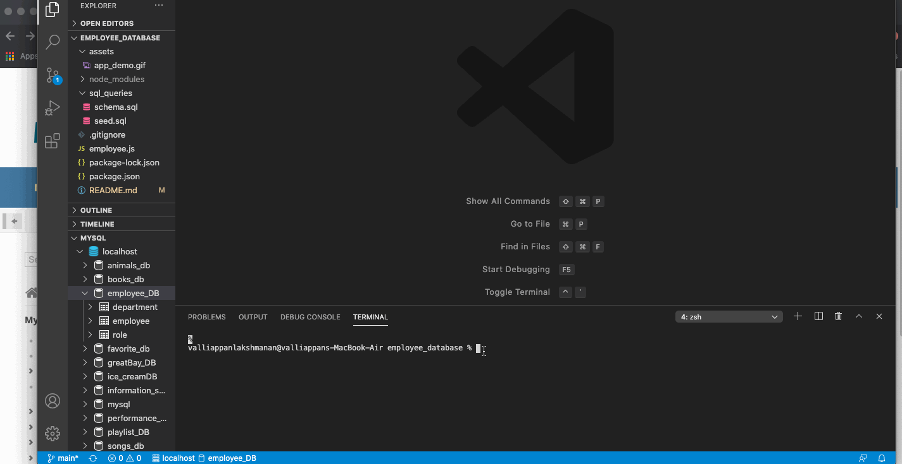

# employee_database
A CLI app that allows a user to create,read,update,and delete data from a mysql database. It uses inquirer to recieve inputs from the user and the mysql node package to create, read, udpate, and delete values in our mysql database. 

# Table of contents

* [Tech Used](#Tech)
* [Installation](#Installation)
* [Usage](#Usage)
* [Questions](#Questions)

# Tech 
* Node/npm
* inquirer
* mysql 

# Installation 
Before you fork and clone this repo to your local computer, you should first install mysql data base to your computer. Follow the instructions provided at this [link](https://dev.mysql.com/doc/mysql-installation-excerpt/5.7/en/). You will then have to create a connection to your mysql database. 

Once you have done that, you can then go ahead and fork, and clone this repo to your local computer. Run the files in the sql_queries folder, which will set up your database and create your tables, then run npm install to install all neccesary dependencies, and finally to start the application just "npm start" in your terminal. 

# Usage 
The app will ask you which action you would like to take. You can choose to add, update, view, or delete data from the database you just created. Check out the gif below to get a better understanding of how to use the app. 

# Questions 

Still confused? Think there is a better way I can write my code? Did I miss a key part of functionality? Let me know! Just drop me message on github.